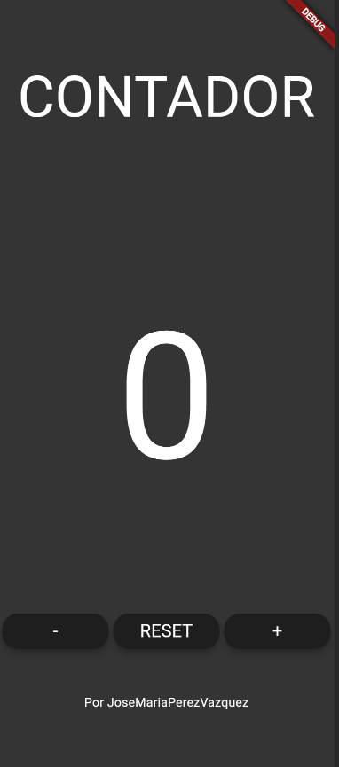
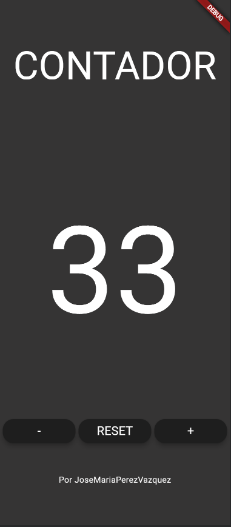

# Ejercicio 02 Flutter
Deberás de crear una clase en flutter que sea una plantilla de los botones, en la que le pases el argumento de texto y sustituirlo por los 3 botones que tenemos → 2 puntos
Darle funcionalidad a los botones, cambios solo por consola → 2 puntos
Cambios por pantalla → 4 puntos.
README → 2 puntos.

## Desarrollo del Ejercicio
Saber posicionar elementos, diseño y poder utilizar los elementos de los botones con las operaciones que tienen nombradas

**1. Primer Contenedor**: Texto centrado con la palabra "CONTADOR" 

**2. Segundo Contenedor**: Tenemos el numero 0 en el centro que tiene la funcionalidad de incrementarse, resetearse o decrementarse, la altura respecto al título lo conseguimos con **SizedBox** especificando la altura deseada.

**3. Tercer Contenedor**: Tenemos los botones alineados a través de **Row** usando **ElevatedButton** y **onPressed** con su respectiva funcionalidad. (Esto esta dividido en tres **Child** en su interior)

**4. Cuarto**: Texto simple donde especificamos el autor del contador

## Componente Utilizados
**Row**: Para la organización de los contenedores

**ElevatedButton**: Widget que representa un botón con un aspecto elevado

**onPressed**: Propiedad clave de **ElevatedButton** y se utiliza para especificar la función que se debe llamar cuando el botón se presiona.

**SizedBox**: Para especificar la cantidad altura que queremos entre cada elemento

**Widget Counter**: Usamos **StatefulWidget** que representa la pantalla principal del contador. Utiliza la clase **CounterState** para gestionar el estado del contador(0), el contador se puede incrementar, decrementar y resetear a través de los botones.

**btn_class.dart**: En este archivo definimos como son los botones, con sus características y especificamos cuales son las variables que queremos cambiar al ser diferentes, por ejemplo, el texto que se encuentra dentro del boton.

## Interfaz

## Como iniciar la aplicación

**Primer paso**: Tener flutter instalado en tu dispositivo junto a la variables de entorno

**Segundo paso**: Tener en Visual Studio Code la extensión de **Flutter** y **Dart**

**Tercer paso**: Abrir el terminar y escribir el comando **flutter run**

**Opcional**: Puedes elegir en que dispositivo o navegador lo quieres ejecutar

## Aplicación Utilizada
Visual Studio Code

## Autor
José María Pérez Vázquez

