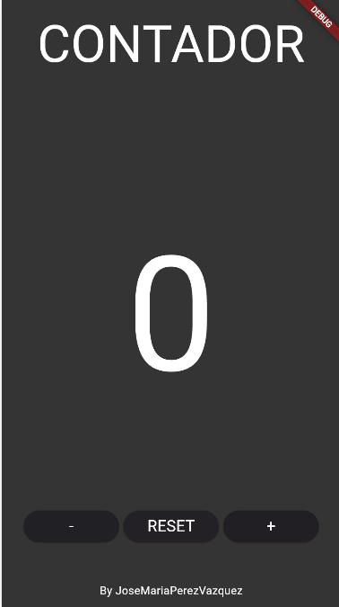

# Ejercicio 02 Flutter
Crea un nuevo PROYECTO y crea la calculadora que creamos en android(sin funcionalidad por ahora).

## Desarrollo del Ejercicio
Principalmente saber posicionar elementos y el diseño

**1. Primer Contenedor**: Texto centrado con la palabra "CONTADOR" 

**2. Segundo Contenedor**: Tenemos el numero 0 en el centro que un futuro tendra la funcionalidad de incrementarse, resetearse o decrementarse, la altura respecto al título lo conseguimos con **SizedBox** especificando la altura deseada.

**3. Tercer Contenedor**: Tenemos los botones alineados a través de **Row** usando **ElevatedButton** y **onPressed** para que se vea como un botón que tendrá su funcionalidad en el futuro. (Esto esta dividido en tres **Child** en su interior)

**4. Cuarto**: Texto simple donde especificamos el autor del contador

## Componente Utilizados
**Row**: Para la organización de los contenedores

**ElevatedButton**: Widget que representa un botón con un aspecto elevado

**onPressed**: Propiedad clave de **ElevatedButton** y se utiliza para especificar la función que se debe llamar cuando el botón se presiona.

**SizedBox**: Para especificar la cantidad altura que queremos entre cada elemento

## Interfaz

## Como iniciar la aplicación

**Primer paso**: Tener flutter instalado en tu dispositivo junto a la variables de entorno

**Segundo paso**: Tener en Visual Studio Code la extensión de **Flutter** y **Dart**

**Tercer paso**: Abrir el terminar y escribir el comando **flutter run**

**Opcional**: Puedes elegir en que dispositivo o navegador lo quieres ejecutar

## Aplicación Utilizada
Visual Studio Code

